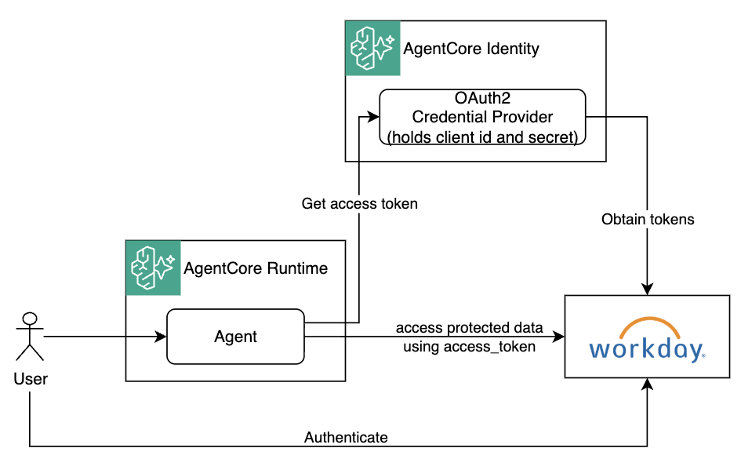
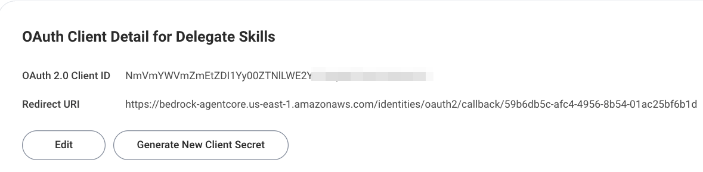

# Bedrock AgentCore Identity - User Federation with Workday Agents

This project illustrates how to configure the integration between an Amazon Bedrock [AgentCore Identity OAuth2 Credential Provider](https://docs.aws.amazon.com/bedrock-agentcore/latest/devguide/identity-outbound-credential-provider.html) and **Workday's Agent Registry**, so an agent running on AgentCore can obtain an OAuth2 access token representing a specific Workday user for making requests to Workday's MCP and A2A endpoints.



The benefit of this setup is that long-lived Workday's credentials (client_id, client_secret) are never exposed to the agent. Instead, they're stored in AgentCore's secure token vault, AgentCore mediates the entire OAuth2 exchange, and the agent only ever receives short-lived, user-scoped access tokens - so a compromised agent can't leak the client secret or a durable credential.

> Only the AgentCore Identity component is implemented in this project, not Runtime

> This project illustrates Workday-specific configuration. For generic AgentCore Identity concepts, the control-plane/data-plane model, and the end-to-end flow deep dive, see the reference sample - **https://github.com/aal80/agentcore-samples/tree/main/identity-user-federation-with-jwt**

## Prerequisites

- An agent registered and activated in Workday, either in Agent Management Hub or as API Client.
- When activating an agent in Workday, set `redirect_uri` parameter to some placeholder, like `http://localhost`. You will update it later. 
- You need to know the value of the `issuer` claim that Workday-issued JWTs will have. 

## Configuring AgentCore Identity Credential Provider

See `./terraform/oauth2_credential_provider.tf` for full configuration. 

> IMPORTANT: Workday's `/token` endpoint expects client credentials in the POST request body. Hence, set client authentication method to CLIENT_SECRET_POST, as illustrated below.

```hcl
resource "awscc_bedrockagentcore_o_auth_2_credential_provider" "workday" {
  name                       = local.project_name
  credential_provider_vendor = "CustomOauth2"

  oauth_2_provider_config_input = {
    custom_oauth_2_provider_config = {
      client_id     = var.client_id
      client_secret = var.client_secret

      client_authentication_method = "CLIENT_SECRET_POST"

      oauth_discovery = {
        authorization_server_metadata = {
          issuer                 = var.oauth2_issuer
          authorization_endpoint = var.oauth2_authz_endpoint
          token_endpoint         = var.oauth2_token_endpoint
          response_types         = ["code"]
        }
      }
    }
  }
}
```

## Where to see the implementation specifics
  * See `./terraform` for AgentCore Identity OAuth2 Credential Provider configuration
  * See `./scripts/test.py` to the test workflow script. 

## Running the workflow walkthrough

### Step 1: Configure your Workday OAuth2 client settings

1. Copy or rename `./terraform/terraform.tfvars.example` to `./terraform/terraform.tfvars`. 

2. Update `./terraform/terraform.tfvars` with your Workday agent/client values:

    ```hcl
    client_id     = "<your-workday-client-id>"
    client_secret = "<your-workday-client-secret>"

    oauth2_issuer         = "https://<tenant-host>.workday.com/ccx/api/v1/<tenant>"
    oauth2_authz_endpoint = "https://<region>.agent.workday.com/auth/authorize/<tenant>"
    oauth2_token_endpoint = "https://<region>.agent.workday.com/auth/oauth2/<tenant>/token"
    ```

> IMPORTANT: In this sample project client credentials (id/secret) are stored in `tfvars` file for brevity. In real production environments you should use [AWS Secrets Manager](https://aws.amazon.com/secrets-manager/) for storing sensitive credentials, and referencing them from your Terraform configurations. 

### Step 2. Deploy

1. Run the below command: 

    ```bash
    make deploy # runs terraform init && terraform apply --auto-approve
    ```

2. This creates the workload identity and AgentCore Identity Custom OAuth2 Credential Provider configured for Workday integration. 

3. The outputs section contains credential provider's `callback_url`:

    ```
    Apply complete! Resources: 6 added, 0 changed, 0 destroyed.

    Outputs:

    credential_provider_callback_url = "https://bedrock-agentcore.us-east-1.amazonaws.com/identities/oauth2/callback/59b6db5c-2222-4956-1111-01ac25bf6b1d"

    ...REDACTED...
    ```

4. Update the agent/client registered in Workday with this `callback_url`. The redirect URL your Workday agent/client is registered with must match this value exactly.

    

### 3. Run the flow

1. Run the below command: 

    ```bash
    make test
    ```

2. The script prints an `authz_url`, then pauses. 

    ```bash
    ❯ make test
    cd scripts && uv run test.py
    > Starting authentication workflow for 'eatl-ac-with-wd-idp'...
    > Getting workload access token for user federation...
    | workload_access_token=AgV4sb8TuwjdeBlo_2l-...
    | status_code=200
    | authz_url=https://bedrock-agentcore.us-east-1.amazonaws.com/identities/oauth2/authorize?request_uri=urn%3Aietf%3Aparams%3Aoauth%3Arequest_uri%3AY2U3ZTczNWEtNjdhOS00OTY1LWE2YzgtY2ZiMDAzODZkOTFm

    ...REDACTED...
    ```

3. Open the URL it in your browser and log in as your **Workday** user. 

4. After login the browser is redirected to `http://localhost` (an error page there is expected, in reality this would be the URL of your application). 

5. Return to where you ran the script and press **Enter** to complete the session and print the user's `access_token`:

    ```bash
    Open authz_url in your browser and log in, then press Enter to continue...
    > Finishing authentication workflow for 'eatl-ac-with-wd-idp'...
    | status_code=200
    > Getting resource token from 'eatl-ac-with-wd-idp'...
    > Getting workload access token for user federation...
    | workload_access_token=AgV4dx1UWVG-in9GOtcH...
    | status_code=200
    | access_token=eyJ4NXQjUzI1NiI6Inlvc...REDACTED...
    ```

### 4. Clean up

Run the below command: 

```bash
make destroy
```
