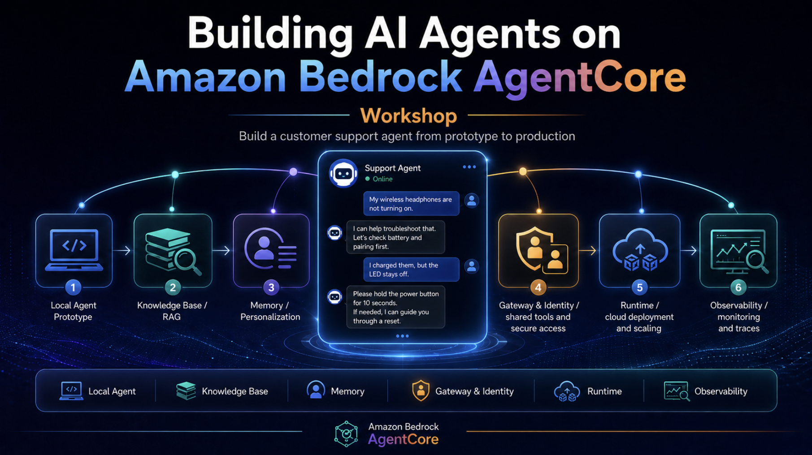

# Building AI Agents with Amazon Bedrock AgentCore - Workshop

## Overview

[Amazon Bedrock AgentCore](https://aws.amazon.com/bedrock/agentcore/) helps you deploy and operate AI agents securely at scale - using any framework and model. It provides you with the capability to move from prototype to production faster.

In this workshop, you will go through an end-to-end journey from prototype to production building a Customer Support Agent. You will use the [Strands Agents SDK](https://strandsagents.com/), a simple-to-use, code-first framework for building agents and the Claude Sonnet 4.6 model via [Amazon Bedrock](https://aws.amazon.com/bedrock). 

> AgentCore supports using any model and agentic framework to run your agents, such as Strands, LangChain, LangGraph and more. While Strands SDK is used for this workshop, the concepts can be applied to any other frameworks and models as well.

## Workshop Journey

* [Module 0: Installing pre-requisites](./m00-bootstrap.md)
* [Module 1: Creating a local Agent prototype - Build a functional customer support agent](./m01-local-agent.md)
* [Module 2: Adding a Knowledge Base - Grounding agent responses in factual data](./m02-knowledge-base.md)
* [Module 3: Enhancing your agent with Memory - Add conversation context and personalization](./m03-memory.md)
* [Module 4: Adding remote tools with AgentCore Gateway - Expose tools over MCP and secure inbound access with AgentCore Identity](./m04-gateway.md)
* [Module 5: Securing outbound authentication with AgentCore Identity - Use Credential Providers to authenticate agent-to-tool calls](./m05-identity.md)
* [Module 6: Running in cloud - Deploying and scaling your agent in cloud using AgentCore Runtime ](./m06-runtime.md)
* [Module 7: Monitoring your agent with AgentCore Observability ](./m07-observability.md)
* [Module 8: Conclusion ](./m08-conclusion.md)

## Let's get started!

Next step - [Module 0: Installing pre-requisites](./m00-bootstrap.md)
