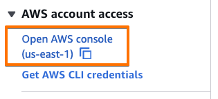

1. Open AWS Console. When using AWS-provided workshop accounts, click the following link:

    

Open to **CloudWatch**. Find **Settings** at the very bottom of left side menu. Insite of it, click on the **X-Ray traces tab**

    

1. Click **View settings** for Transactional Search. If **Ingest OpenTelemetry spans** shows `Enabled` - move to the next step. If it shows `Disabled` - click the **Edit** button to enable it and set **Trace indexing** to 100% to capture all traces. 

    

1. Enabling **Transactional Search** takes approximately 5-10 minutes. You do not need to wait - proceed with the next workshop steps. 
