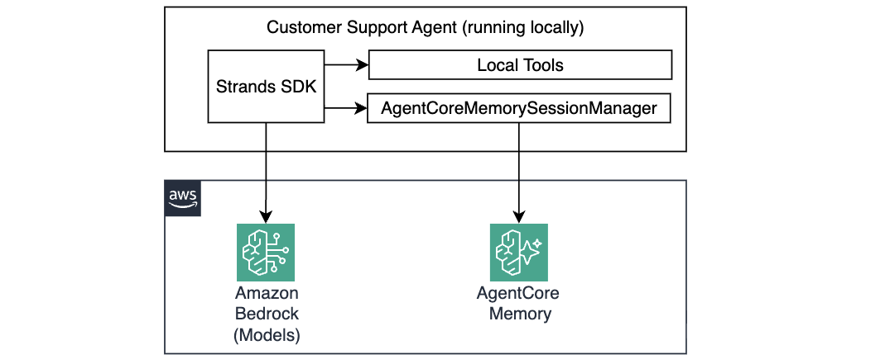
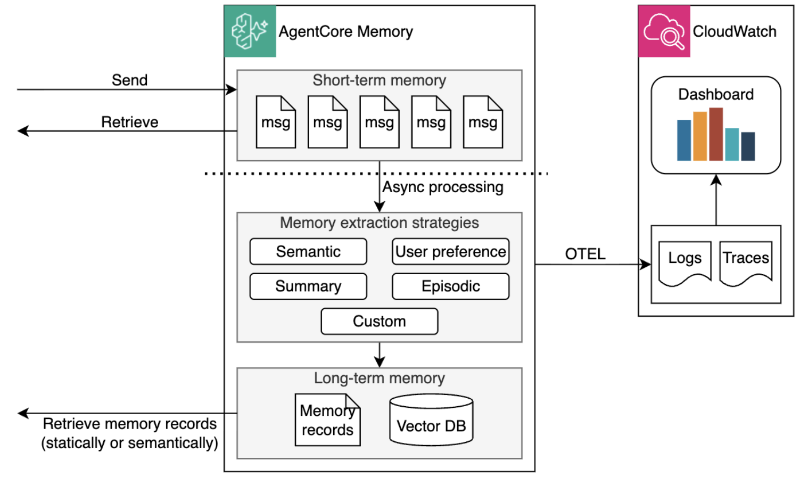

# Module 3: Personalizing the Agent with Memory

In the previous module, your agent gained the ability to answer technical questions using grounded facts stored in the Bedrock Knowledge Base. But it still has no recollection of the past — every conversation turn starts from scratch. Ask it "What did we just talk about?" - and it has no idea.

In this module you'll add **Amazon Bedrock AgentCore Memory** to your agent, so it can remember customer preferences, facts, and past interaction episodes across sessions.



## How AgentCore Memory works

AgentCore Memory is a managed service that provides your agent with conversation history. It organizes memory into two tiers:

- **Short-term memory (STM)** — the current session's conversation, stored after user, agent, and model exchange messages. 
- **Long-term memory (LTM)** — persistent patterns and facts, extracted asynchronously from STM and organized by namespace using vector embeddings for semantic retrieval.



You can configure various **strategies** that define what kind of information to store and where, for example:

| Strategy | What it captures | Example |
|---|---|---|
| `USER_PREFERENCE` | Behavioral patterns, preferences, habits | "the user prefers ThinkPad, budget under $1200" |
| `SEMANTIC` | Factual information from conversations | "MacBook Pro order #MB-78432 under warranty" |
| `SUMMARY` | Condensed real-time summaries of a single session - key topics, tasks, decisions | "User reported overheating issue, agent recommended cleaning vents and updating drivers" |
| `EPISODIC` | Structured sequences of past interactions across sessions, including situation, intent, and outcome; also generates cross-episode reflections | "Agent resolved a deployment error by switching tools after first attempt failed" |
| `CUSTOM` | Your custom extraction rules - you define the schema, namespaces, and consolidation logic | A restaurant agent that deduplicates and merges dining preferences using its own business logic before storing |

Each user's memories are isolated using **namespaces** with `{actorId}` as a placeholder — so `support/customer/{actorId}/preferences/` becomes a unique memory space per user at runtime. 

When an agent starts a conversation, `AgentCoreMemorySessionManager` class, provided by the Strands SDK, automatically:
1. Retrieves relevant memories and injects them into the context
1. Stores the new conversation memory for async LTM processing

## Step 1: Before enabling memory

Before you add memory capabilities to your agent, let's illustrate the problem:

1. Start the agent and ask about an overheating issue:

    ```bash
    make run-agent-locally
    ```

1. Ask the agent

    ```text
    My MacBook Pro overheating during video editing, what's the return policy?
    ```

    Wait for the agent to reply. 

1. Now ask it: 

    ```text
    What was my previous problem?
    ```

1. The agent has no idea what you've asked it just a moment ago:

    ```
    I don't have access to your previous conversation history, so I can't see what your previous problem was. 

    To help you effectively, could you please share some details about:
    - What product or issue you're currently facing
    - Any specific symptoms or errors you're experiencing
    - When the problem started
    ```

    It starts each iteration completely fresh. This is exactly the limitation you're fixing.

1. Stop your agent by telling it to `exit`.

## Step 2: Enable AgentCore Memory

1. Open `./terraform/workshop.tf` and uncomment the `memory` module:

    ```hcl
    # --- Module 3: Uncomment to deploy AgentCore Memory
    module "memory" {
      source       = "./memory"
      project_name = local.project_name
      region       = data.aws_region.current.region
    }
    ```

1. Deploy changes:

    ```bash
    make deploy-infra
    ```

    This creates AgentCore Memory resources with two strategies configured and writes the Memory ID to `tmp/memory_id.txt` so you can test it locally. 

1. Memory deployment can take several minutes. In the meanwhile, explore `./terraform/memory` resources. For example, this is how you define the memory and strategy:

    ```hcl
    resource "aws_bedrockagentcore_memory" "customer_support" {
      name                  = "${local.project_name_underscored}_customer_support"
      description           = "Customer support agent memory"
      event_expiry_duration = 7
    }

    resource "aws_bedrockagentcore_memory_strategy" "preferences" {
      name        = "CustomerSupportPreferences"
      description = "Captures customer preferences and behavior"
      memory_id   = aws_bedrockagentcore_memory.customer_support.id
      type        = "USER_PREFERENCE"
      namespaces  = ["support/customer/{actorId}/preferences/"]
    }
    ```
    
    Note the `namespaces` parameter in the strategy configuration. It defines that extracted preferences will be scoped to each user (actorId). 

1. Once Terraform completes, verify the memory resources were created using the AWS Console:

    - Open the [Amazon Bedrock AgentCore console](https://console.aws.amazon.com/bedrock-agentcore/)
    - In the left navigation, go to **Build → Memory**
    - You should see `<prefix>_building_ai_agents_customer_support` with status **Active**

## Step 3: Understand how AgentCoreMemorySessionManager works

The memory configuration for Agent is implemented in `./src/agent/memory_config.py`. Explore this file to understand what's being configured. Memory ID is retrieved from an environment variable, `AgentCoreMemoryConfig` defines memory configuration, and an instance of `AgentCoreMemorySessionManager` is created:

```python
MEMORY_ID = os.environ.get("MEMORY_ID")
ACTOR_ID = "customer-123"   # In production this comes from the authenticated user identity

memory_config = AgentCoreMemoryConfig(
    memory_id=MEMORY_ID,
    batch_size=1, 
    flush_interval_seconds=1, 
    session_id=session_id, # passed by the client
    actor_id=ACTOR_ID,
    retrieval_config={
        "support/customer/{actorId}/semantic/":    RetrievalConfig(top_k=3, relevance_score=0.2),
        "support/customer/{actorId}/preferences/": RetrievalConfig(top_k=3, relevance_score=0.2),
    }
)

session_manager = AgentCoreMemorySessionManager(memory_config)
```

Now open [src/agent/agent.py](src/agent/agent.py), see around line 40. The memory integration is already wired in:

```python
from memory_config import get_session_manager

session_id = str(uuid.uuid4())
session_manager=get_session_manager(session_id)

agent = Agent(
    model=model,
    system_prompt=SYSTEM_PROMPT,
    tools=tools,
    session_manager=session_manager, # <-- here
)
```

## Step 4: Repeat the test with memory enabled

1. Repeat the same two runs from Step 1. Restart your agent by running

    ```bash
    make run-agent-locally
    ```

1. **First question** — same prompt, now with memory enabled. Ask the agent:

    ```text
    My MacBook Pro overheating during video editing, what's the return policy
    ```

    The agent answers as before, but this time the agent immediately persists the conversation in short-term memory. 

1. **Second question** — ask the follow-up in the same session, without any additional context. Ask the agent:

    ```text
    What was my previous problem?
    ```

    The response reflects the newly enabled memory functionality:

    ```
    Your previous problem was **overheating issues with your MacBook Pro specifically during video editing**. 

    Since you mentioned this is a new MacBook Pro that you use for video editing work, overheating during 
    intensive tasks like video editing is a common concern, especially when rendering large files or 
    using demanding software.
    ```

In addition, within a few minutes AgentCore Memory asynchronously extracts information from short-term memory and stores it in the long-term memory, so memory can persist across different sessions of the same user as well.

That's memory persistence, consolidation, extraction, and retrieval in action!

## How it works under the hood

1. `AgentCoreMemorySessionManager` queries both memory namespaces for context relevant to the incoming message
1. Retrieved memories are injected into the conversation context before the LLM sees the prompt
1. The LLM composes a response informed by the customer's history
1. After the response, the new exchange is stored as an STM event
1. AgentCore asynchronously processes STM events into LTM strategies (preferences + semantic facts)

## Congratulations!

Your agent now remembers customers across sessions!

## Next Step

Proceed to [Module 4](m04-gateway.md) to integrate your agent with AgentCore Gateway to securely share tools across multiple agents.
