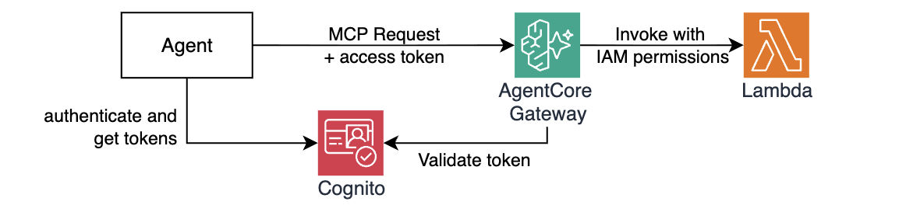

# Module 4: Adding remote tools with AgentCore Gateway - Expose tools over MCP and secure inbound access with AgentCore Identity

In Module 3, your agent gained persistent memory. But every tool it uses — `get_return_policy`, `get_product_info`, `get_technical_support` — still lives directly in its own codebase.

Imagine you now have to build several new agents - a Sales Agent that needs `get_product_info`, a Returns Agent that needs `get_return_policy`, and an Inventory Agent that needs both. You'd copy the same tool code into every agent. Any fix or change has to be replicated everywhere. There's no central place to control which agent is allowed to call which tool.

In this module you'll solve this with **Amazon Bedrock AgentCore Gateway**. Gateway converts a wide variety of targets, such as Lambda functions or HTTP services, into [Model Context Protocol (MCP)](https://modelcontextprotocol.io/docs/getting-started/intro) endpoints — a standard that any agent framework understands. Your agents connect to a single Gateway URL and discover all available tools through the MCP protocol, regardless of where the underlying tool implementations are deployed.


## Why this matters

| Before (Modules 1–3) | After (this module) |
|---|---|
| Each agent has its own copy of each tool | Tools are deployed once, shared across agents |
| Updating a tool means updating every agent | Update the tool implementation, such as a Lambda function, all agents see the change |
| No access control between agents and tools | Cognito JWT authentication + Cedar policies |
| Tools run on your laptop | Tools run in cloud and are always available |

## Authentication Model

In addition to scaling improvements, AgentCore Gateway adds the security layer. It requires agents to securely authenticate prior to letting them access MCP tools. **AgentCore Identity** is the component that provides seamless agent identity and access management across AWS services and third-party applications such as Slack and Zoom, supporting any standard OAuth2 identity providers such as Okta, Entra, or Amazon Cognito. 

In this module you'll see how AgentCore Gateway integrates with AgentCore Identity to provide secure connections for inbound and outbound authentication.



**Inbound authentication** — When an agent (or other MCP client) calls a tool in the Gateway, it passes an OAuth2 access token generated from the user's Identity Provider (IdP). AgentCore Gateway validates this token and uses it to decide whether to allow or deny the request. You will define it in this module.

**Outbound authentication** — When the Gateway invokes a downstream target (such as a Lambda function), it can use either OAuth2 access tokens, API Keys, or AWS IAM role associated with the Gateway to authorize that call. This means the agent NEVER persists long-lived credentials for downstream resources. You will implement this in the next module. 

## Step 1: Before adding the Gateway

Before adding the Gateway, let's confirm what the current agent is capable of. 

1. Start the agent and ask a warranty question:

    ```bash
    make run-agent-locally
    ```

2. Ask the agent: 

    ```text
    I have a Gaming Console Pro. My warranty serial number is MNO33333333. Am I covered?
    ```

    Response:

    ```text
    I appreciate you sharing those details, but I'm afraid I'm not able to look up individual warranty coverage or verify serial numbers in our system. That's outside of what I'm able to access.

    To get your warranty status checked for your Gaming Console Pro with serial number MNO33333333, I'd recommend reaching out through one of these options:

    - Contact our warranty support team directly with your serial number and proof of purchase
    - Reach out to the manufacturer of the Gaming Console Pro, as they can verify coverage using your serial number
    ```

    The agent doesn't have the `check_warranty_status` tool implemented yet — it might try to fall back to the knowledge base or admit it can't answer. Type `exit` to quit and let's fix that.

## Step 2: Deploy the Gateway infrastructure

1. Open `./terraform/workshop.tf` and uncomment the `gateway` module:

    ```hcl
    # --- Module 4: Uncomment to deploy AgentCore Gateway
    module "gateway" {
      source       = "./gateway"
      project_name = local.project_name
      region       = data.aws_region.current.region
    }
    ```

1. Deploy the updates:

    ```bash
    make deploy-infra
    ```

    This will:

    - Deploy a Lambda function containing `check_warranty_status`
    - Create a Cognito User Pool and App Client for inbound JWT authentication 
    - Create the AgentCore Gateway with the Cognito JWT authorizer
    - Register the Lambda as a Gateway target, exposing the tool via MCP 
    - Write `tmp/gateway_url.txt`, `tmp/cognito_token_endpoint.txt`, `tmp/cognito_client_id.txt`, and `tmp/cognito_client_secret.txt` so you can test the gateway locally.

    > If seeing `cognito_client_secret` output in clear text immediately raises a red flag for you - you're absolutely right! You'll fix this security concern in the next module. 

1. While deployment is running, explore resources under `./terraform/gateway`.

    The Gateway resource declares mandatory authorization using Cognito provider OAuth2 token and scope:

    ```hcl
    resource "aws_bedrockagentcore_gateway" "customer_support" {
      name        = "${var.project_name}-customersupport-gw"
      authorizer_type = "CUSTOM_JWT"
      authorizer_configuration {
        custom_jwt_authorizer {
          discovery_url  = local.cognito_discovery_url
          allowed_scopes = [local.cognito_scope]
        }
      }
      ...REDACTED...
    }
    ```

    The Gateway target resource defines outbound authorization with IAM Role as well as tool schema:

    ```hcl
    resource "aws_bedrockagentcore_gateway_target" "check_warranty_status" {
      name               = "check-warranty-status"

      # Outbound authorization
      credential_provider_configuration {
        gateway_iam_role {}
      }

      # Target configuration and tool schema
      target_configuration {
        mcp {
          lambda {
            lambda_arn = aws_lambda_function.tool_check_warranty_status.arn

            tool_schema {
              inline_payload {
                name        = "check_warranty_status"

                input_schema {
                  type = "object"

                  property {
                    name        = "serial_number"
                    type        = "string"
                    description = "Product serial number to look up"
                    required    = true
                  }

    ...REDACTED...
    ```

1. Once Terraform completes, verify the Gateway is active in the AWS Console:

    - Open the [Amazon Bedrock AgentCore console](https://console.aws.amazon.com/bedrock-agentcore/)
    - In the left navigation, go to **Build → Gateway**
    - You should see `<prefix>-building-ai-agents-customersupport-gw` with status **Ready**
    - Click into it and confirm the **Targets** section shows the Lambda target with the `check_warranty_status` tool and `Ready` status.
    - Confirm **Inbound Auth** section displays Cognito configuration. 

## Step 3: Understand the remote check_warranty_status tool

1. Back in the VS Code, examine the Lambda function code at `./src/lambdas/tool-check-warranty-status/handler.py`. It implements a mock warranty database, checking warranty coverage given a product serial number and optionally a customer email: 

    ```python
    def lambda_handler(event, context):
        serial_number  = event.get("serial_number", "")
        customer_email = event.get("customer_email")
        # looks up warranty coverage from customer database
    ```

The tool schema that describes this to the Gateway is defined in `./terraform/gateway/gateway.tf` as an `inline_payload` block (shown above). It tells Gateway the tool name, description, and input parameters — the same information the `@tool` docstring would provide locally.

When configuring AgentCore Gateway with HTTP or MCP target types, you can use auto-discovery capability to discover schemas automatically. 

## Step 4: Test AgentCore Gateway is working 

> This step is for local testing and illustration purposes only! When running on AgentCore, the agent will fetch required access tokens and tools list on its own.

1. The Gateway requires a valid JWT token for every request. Let's test that one can be fetched using Cognito credentials. Run the below command:

    ```bash
    make get-cognito-access-token
    ```

    This reads `tmp/cognito_token_endpoint.txt`, `tmp/cognito_client_id.txt`, and `tmp/cognito_client_secret.txt`. Then the script calls the Cognito token endpoint and outputs the retrieved token.

2. Let's test that the Gateway is up and running. Run the below command:

    ```bash
    make test-gateway 
    ```

    This will use access token retrieved in previous step and make a `tools/list` call to the gateway endpoint using `curl`. 

    Response:

    ```json
    {
      "jsonrpc": "2.0",
      "id": "1",
      "result": {
        "tools": [
          {
            "inputSchema": {
              "type": "object",
              "properties": {
                "customer_email": {
                  "description": "Customer email address to verify ownership (optional)",
                  "type": "string"
                },
                "serial_number": {
                  "description": "Product serial number to look up",
                  "type": "string"
                }
              },
              "required": [
                "serial_number"
              ]
            },
            "name": "check-warranty-status___check_warranty_status",
            "description": "Check warranty coverage for a product given its serial number. Optionally verifies against the registered customer email."
          }
        ]
      }
    }
    ```

Now that you've confirmed the Gateway is working, it's time to integrate it with the agent.

## Step 5: Connect the agent to Gateway

Unlike local tools you've implemented in the agent previously, you do not need to declare tools available through MCP and AgentCore Gateway one by one. MCP supports automatic tool discovery, so you only need to point your agent at the Gateway endpoint. 

1. Explore `./src/agent/mcp_client.py`. There are several important segments to understand. 

1. First, on initialization this module tries to get the `GATEWAY_URL` from environment variables. If this variable is not yet available - the list of MCP tools remains an empty array. 

    ```python
    GATEWAY_URL = os.environ.get("GATEWAY_URL")
    l.info(f"mcp_client :: GATEWAY_URL={GATEWAY_URL}")
    mcp_tools_list = []

    if not GATEWAY_URL :
        l.info("⚠️ GATEWAY_URL not available, gateway tools disabled")
    ```

1. Then, it attempts to retrieve the access token required to invoke the Gateway from Cognito. If access token retrieval fails - the list of MCP tools remains an empty array. When access token is successfully retrieved, an MCP client is used to retrieve the list of tools:

    ```python
    # attempt to retrieve access token
    elif not(gateway_access_token := get_token()): 
        l.info("⚠️ gateway_access_token not available, gateway tools disabled")
    else:
        mcp_client = MCPClient(lambda: streamablehttp_client(
            GATEWAY_URL,
            headers={"Authorization": f"Bearer {gateway_access_token}"}
        ))

        mcp_client.start()
        mcp_tools_list = mcp_client.list_tools_sync()
        l.info(f"✅ Retrieved {len(mcp_tools_list)} tools")
    ```

1. Lastly, the agent code automatically picks up the new list of MCP tools in `agent.py`:

    ```python
    from mcp_client import mcp_tools_list

    tools = [
        get_return_policy, 
        get_product_info, 
        get_technical_support,
        mcp_tools_list # <-- here
    ]

    agent = Agent(
        model=model,
        system_prompt=SYSTEM_PROMPT,
        tools=tools,
        session_manager=session_manager,
    )
    ```

## Step 6: Test the agent with Gateway tools

1. Restart the agent by running:

    ```bash
    make run-agent-locally
    ```

2. Ask the same warranty question:

    ```text
    I have a Gaming Console Pro. My warranty serial number is MNO33333333. Am I covered?
    ```

    See agent response, reflecting the newly integrated MCP tool:

    ```
    I'll check the warranty status for your Gaming Console Pro right away.

    [Tool called: check-warranty-status___check_warranty_status]

    Great news! **Your Gaming Console Pro is covered under warranty!**

    Here are the details:
    - **Product:** Gaming Console Pro
    - **Serial Number:** MNO33333333
    - **Warranty Status:** Active
    - **Coverage Until:** June 30, 2026

    Your warranty is active and valid, so you're well protected! You have coverage for quite some time yet.
    ```

Great job! The agent is now consuming the `check_warranty_status` using the MCP endpoints provided by the AgentCore Gateway.

## How it works under the hood

1. `mcp_client.list_tools_sync()` connects to `GATEWAY_URL` with the access token retrieved from Cognito.
2. Gateway validates the token against the Cognito User Pool's discovery URL
3. Gateway returns the MCP tool manifest (names, descriptions, schemas) from the inline tool schema defined in Terraform
4. When the agent selects `check_warranty_status`, it invokes the tool via the MCP session
5. Gateway forwards the request to the Lambda function
6. Lambda executes and returns the result
7. Gateway returns the result back to the MCP client, which surfaces it to the agent

Authentication is enforced at Step 2 — valid JWT is mandatory for tool access!

## Congratulations!

Your tools are now centralized and authenticated.

- **`check_warranty_status`** is a new remote tool (via MCP) that can be used by any authorized agents without any local code
- **Cognito JWT authentication** enforces inbound authentication, making sure that only agents with valid tokens can call any tool
- **MCPClient** connects to the Gateway and pulls tools over MCP

## Next step

Proceed to [Module 5](m05-identity.md) to further secure your agent by storing OAuth2 client credentials and tokens in AgentCore's secure token vault. 
