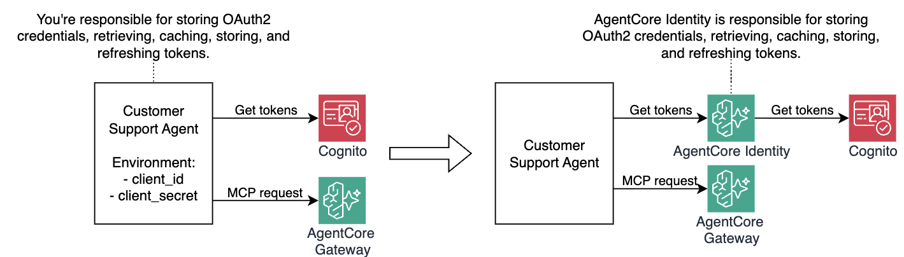
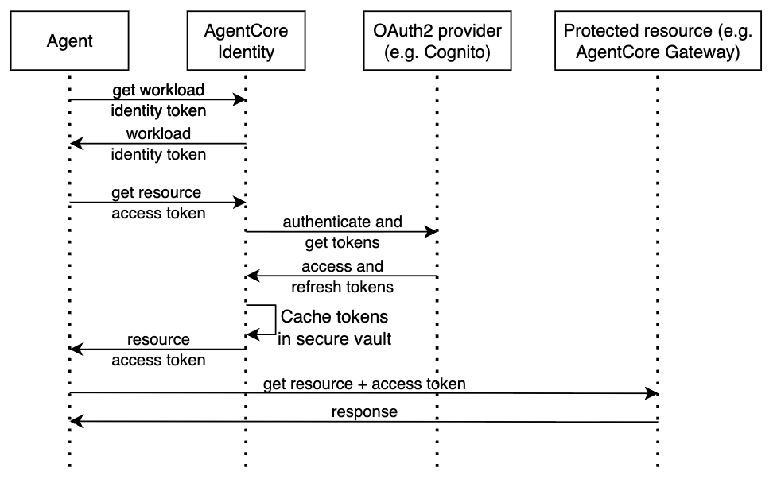

# Module 5: Securing Outbound Authentication with AgentCore Identity

In Module 4, your agent gained access to the `check_warranty_status` tool via AgentCore Gateway. But to call that tool, the agent needs a valid JWT token. And to get that token, the agent is currently reading Cognito client credentials directly from environment variables at startup (`./src/agent/identity_helper.py, line 24`):

```python
COGNITO_CLIENT_ID = os.environ.get("COGNITO_CLIENT_ID")
COGNITO_CLIENT_SECRET = os.environ.get("COGNITO_CLIENT_SECRET")
```

This means the agent has access to long-lived credentials. This creates some real security risks:

- A compromised agent process leaks credentials that remain valid indefinitely
- Credentials injected as environment variables can be read by any code running in the same process
- A single accidental `print()` might leak the secret in your log stream — and since it's a long-lived credential, that exposure doesn't expire
- Rotating credentials requires redeploying the agent
- The same static secret is used across all environments and invocations — there is no per-session or per-user isolation

In this module you'll replace this pattern with **Amazon Bedrock AgentCore Identity** — a managed service that stores credentials in an encrypted **Token Vault** and vends short-lived access tokens on demand. Your agent no longer holds any long-lived secrets. The following diagram illustrates "before" and "after" architecture you'll implement:



## How AgentCore Identity works

AgentCore Identity has two core concepts:

**Workload Identity** — a stable digital identity assigned to your agent. Think of it as the agent's IAM identity.

**Credential Provider** — an AgentCore Identity resource that defines how to obtain an access token from a specific OAuth2 provider (Cognito in this case). It stores the OAuth2 credentials and retrieved tokens in a secure token vault — encrypted at rest, never exposed to the agent.

When the agent needs a token, the two-step flow is:



1. **Get workload identity token** — the agent identifies itself to AgentCore using its workload name, and receives a short-lived AWS-signed token that proves its identity.
2. **Get resource access token** — the agent exchanges the workload identity token for an actual Cognito access token. AgentCore retrieves the stored `client_id` and `client_secret` from the vault, calls Cognito on agent's behalf, stores retrieved tokens (access and refresh) in token vault, and returns the access token back to the agent. The agent NEVER sees the client secret.

## Step 1: Before enabling AgentCore Identity

With previous module deployed, you can see the current (insecure) flow. Look at `./src/agent/identity_helper.py` — when `CREDENTIAL_PROVIDER_NAME` is not set, the agent falls back to direct Cognito calls using plaintext credentials:

```python
def get_token():
    if not CREDENTIAL_PROVIDER_NAME:
        return _get_token_from_cognito_endpoint()  
    ...REDACTED...

def _get_token_from_cognito_endpoint():
    l.info(f"> _get_token_from_cognito_endpoint")
    COGNITO_CLIENT_ID = os.environ.get("COGNITO_CLIENT_ID")
    # Any piece of code in your agent can access long-lived secret like below. Not good. 
    COGNITO_CLIENT_SECRET = os.environ.get("COGNITO_CLIENT_SECRET")
    COGNITO_TOKEN_ENDPOINT = os.environ.get("COGNITO_TOKEN_ENDPOINT")
    COGNITO_SCOPE = os.environ.get("COGNITO_SCOPE")

    l.info(f"COGNITO_CLIENT_ID={COGNITO_CLIENT_ID}")
    # Potential client_secret leakage below! Not good. 
    l.info(f"COGNITO_CLIENT_SECRET={COGNITO_CLIENT_SECRET[:2]}...REDACTED")
    ...REDACTED...

```

The `_get_token_from_cognito_endpoint()` path reads `COGNITO_CLIENT_SECRET` directly from the environment — sourced from `./tmp/cognito_client_secret.txt` written by Terraform. Let's fix that and make it significantly more secure. 

## Step 2: Deploy AgentCore Identity infrastructure

1. Open `./terraform/workshop.tf` and uncomment the `identity` module:

    ```hcl
    # --- Module 5: Uncomment to deploy AgentCore Identity
    module "identity" {
      source                        = "./identity"
      project_name                  = local.project_name
      oauth2_provider_client_id     = module.gateway.cognito_client_id
      oauth2_provider_client_secret = module.gateway.cognito_client_secret
      oauth2_discovery_url          = module.gateway.cognito_discovery_url
    }
    ```

    Notice that `oauth2_provider_client_secret` is passed directly from the gateway module output. The variable is marked `ephemeral=true` and `sensitive=true` in module's `variable.tf`, so it flows through Terraform without being persisted to state.

1. Set `store_raw_cognito_credentials = false` on the gateway module. This removes the plaintext `cognito_client_id.txt` and `cognito_client_secret.txt` files from `./tmp` — the agent no longer needs them:

    ```hcl
    module "gateway" {
      source                        = "./gateway"
      project_name                  = local.project_name
      region                        = data.aws_region.current.region
      store_raw_cognito_credentials = false
    }
    ```

1. Deploy the updates:

    ```bash
    make deploy-infra
    ```

    This will:

    - Create an **AgentCore Workload Identity** for your agent
    - Create an **OAuth2 Credential Provider** backed by the Cognito User Pool, storing the client ID and secret in the Token Vault
    - Write `tmp/workload_identity_name.txt` and `tmp/credential_provider_name.txt` for local testing
    - **Delete** `tmp/cognito_client_id.txt`, `tmp/cognito_client_secret.txt`, and `tmp/cognito_token_endpoint.txt` from your filesystem (created in previous modules)

1. Once Terraform completes, verify the resources in the AWS Console:

    - Open the [Amazon Bedrock AgentCore console](https://console.aws.amazon.com/bedrock-agentcore/)
    - In the left navigation, go to **Build → Identity**
    - You should see your Credential Provider listed

## Step 3: Understand the updated identity_helper.py

Now explore `./src/agent/identity_helper.py`. When `CREDENTIAL_PROVIDER_NAME` is set (which it now will be), the agent takes the secure path:

```python
def _get_token_from_agentcore_identity_credential_provider():
    WORKLOAD_ID_NAME = os.environ.get("WORKLOAD_ID_NAME")
    COGNITO_SCOPE = os.environ.get("COGNITO_SCOPE")

    # Step 1: identify the agent to AgentCore
    response = identity_client.get_workload_access_token(workload_name=WORKLOAD_ID_NAME)
    workload_access_token = response.get("workloadAccessToken")

    # Step 2: exchange workload token for a Cognito access token
    resource_access_token = asyncio.run(identity_client.get_token(
        provider_name=CREDENTIAL_PROVIDER_NAME,
        scopes=[COGNITO_SCOPE],
        auth_flow="M2M",
        agent_identity_token=workload_access_token
    ))
    return resource_access_token
```

The agent only needs to know its workload name and the credential provider name — both are non-secret identifiers. The Cognito client secret NEVER leaves the Token Vault.

The `get_token()` function automatically selects the right path based on whether `CREDENTIAL_PROVIDER_NAME` is set:

```python
def get_token():
    if not CREDENTIAL_PROVIDER_NAME:
        return _get_token_from_cognito_endpoint()   # Module 4 fallback (local dev without identity)
    else:
        return _get_token_from_agentcore_identity_credential_provider()  # Module 5 secure path
```

The direct Cognito path was intentionally introduced first in Module 4 to illustrate what an insecure implementation looks like. For secure implementation, use AgentCore Identity to store long-lived credentials — secrets stay locked in the token vault, your agent never touches them, and token lifecycle is managed for you automatically.

## Step 4: Test the agent with AgentCore Identity

Start the agent:

```bash
make run-agent-locally
```

Since `CREDENTIAL_PROVIDER_NAME` is now set (read from `tmp/credential_provider_name.txt`), the agent will use AgentCore Identity to obtain its token. Ask the same warranty question to confirm everything still works end to end:

```text
I have a Gaming Console Pro. My warranty serial number is MNO33333333. Am I covered?
```

You should see the same response as before — but this time the Cognito client secret was never used by the agent directly.

## How it works under the hood

1. `mcp_client.py` calls `get_token()` from `identity_helper.py`
2. `identity_helper` calls `get_workload_access_token(WORKLOAD_ID_NAME)` — AgentCore verifies the caller's IAM identity and returns a short-lived workload token
3. `identity_helper` calls `get_token(provider_name=CREDENTIAL_PROVIDER_NAME, auth_flow="M2M", ...)` — AgentCore looks up the Credential Provider, retrieves the Cognito client secret from the Token Vault, calls Cognito's token endpoint, and returns the resulting access token
4. The access token is passed to `MCPClient` as the `Authorization: Bearer` header
5. Gateway validates the token and allows the request

The Cognito client secret exists only inside the AgentCore's token vault. It never reaches your agent process.

## Congratulations!

Your agent no longer holds any long-lived credentials.

- **Workload Identity** gives your agent a stable, auditable identity without storing secrets
- **Credential Provider + Token Vault** means Cognito credentials are stored encrypted and vended on demand
- **`store_raw_cognito_credentials = false`** removes plaintext credentials from your local filesystem

## Next step

Proceed to [Module 6](m06-runtime.md) to deploy your agent to the cloud using AgentCore Runtime.
