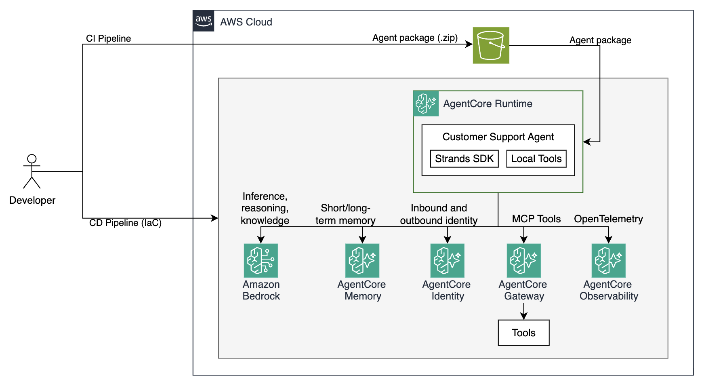
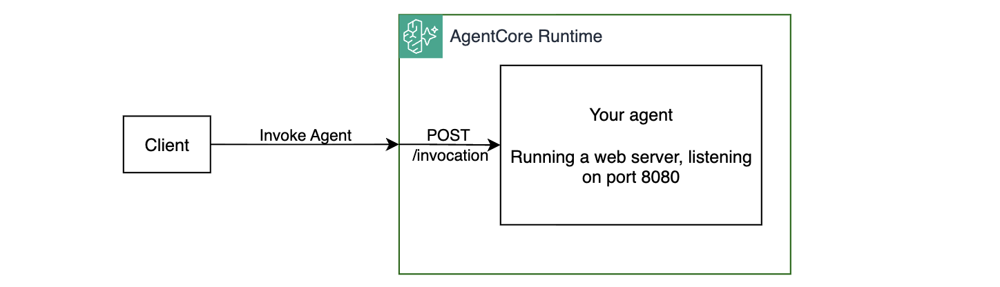

# Module 6: Deploying the Agent to AgentCore Runtime

In the previous module your agent became a secure, gateway-connected service with centralized tools. But it still runs locally on your laptop. Every time your machine sleeps or restarts, the agent disappears. There's no scalable endpoint, tenant session isolation, and no observability pipeline to tell you what the agent is actually doing in production.

In this module you'll deploy the agent to **Amazon Bedrock AgentCore Runtime** — a fully managed runtime purpose-built for AI agents. AgentCore Runtime handles session management, auto-scaling, and built-in observability so you can focus on agent logic instead of infrastructure.

## Why this matters

| Before (Modules 1–5) | After (this module) |
|---|---|
| Agent runs locally | Agent runs on managed cloud compute |
| No HTTP endpoint to call | Can be invoked by anyone (with the right access permissions) |
| No operational visibility | CloudWatch GenAI Observability: traces, spans, token counts |
| Session state in memory | AgentCore manages session lifecycle, incl. long-term memory |
| Manual scaling | Auto-scaled by the runtime |

## Architecture



## How the AgentCore Runtime works

AgentCore Runtime runs your agent in managed microVMs. You provide the agent code either as a .zip file or container image hosted in Amazon Elastic Container Registry (ECR). The runtime handles the rest - routing requests to your container, enforcing authorization, managing session context, auto-scaling, emitting telemetry to CloudWatch, and more. 

## Step 1: Understand how agent.py runs in the cloud

No code changes are needed. Open `./src/agent/agent.py`, scroll to the very bottom:

```python
if __name__ == "__main__":
    if os.environ.get("AGENTCORE_RUNTIME_URL"):
        print("Initializing OTEL...")
        # This initializes OpenTelemetry auto-instrumentation, which you'll explore in the next module
        opentelemetry.instrumentation.auto_instrumentation.initialize()

        print("Running on AgentCore, starting server...")
        app.run()
    else:
        print("Running locally...")
        asyncio.run(run_locally_async())
```

When deployed to AgentCore, the AgentCore Runtime sets `AGENTCORE_RUNTIME_URL` environment variable. The agent detects this, initializes OpenTelemetry, and calls `app.run()`, which starts the HTTP server that the runtime calls on every invocation. 



The AgentCore SDK provides a rapid way of implementing required web interfaces via the `BedrockAgentCoreApp` class. The four key pieces are:

```python
# 1. Import the BedrockAgentCoreApp class
from bedrock_agentcore.runtime import BedrockAgentCoreApp

# 2. Create the application instance
app = BedrockAgentCoreApp()

# 3. Declare the entrypoint - called by the runtime on every invocation
@app.entrypoint
async def invoke(payload, _context=None):
    user_prompt = payload.get("prompt", "Hey there!")
    # ...REDACTED...
    # run agentic loop
    # stream back agent response
    

# 4. Start the HTTP server when AGENTCORE_RUNTIME_URL is set
if os.environ.get("AGENTCORE_RUNTIME_URL"):
    app.run()
```

## Step 2: Package your agent image

To package your agent as a .zip file, run the following command:

```bash
make build-agent-package
```

This installs all the dependencies and packages your agent code under `./tmp/agent_package/agent.zip`.

## Step 3: Deploy agent to AgentCore Runtime

Open `./terraform/workshop.tf` and uncomment the `runtime` module. See the configuration passed to the runtime module from previously deployed components, such as memory, knowledge base, gateway, and identity.

```hcl
# --- Module 6: Uncomment to deploy AgentCore Runtime infrastructure
module "runtime" {
  source                        = "./runtime"
  project_name                  = local.project_name
  region                        = data.aws_region.current.region
  agentcore_memory_id           = module.memory.memory_id
  tech_support_knowledgebase_id = module.knowledge_base.kb_id
  gateway_url                   = module.gateway.gateway_url
  cognito_scope                 = module.gateway.cognito_scope
  credential_provider_name      = module.identity.credential_provider_name
  workload_identity_name        = module.identity.workload_identity_name
}
```

> Ensure you have completed Modules 2-5 and they're uncommented in `workshop.tf` before proceeding

Deploy the changes to cloud:

```bash
make deploy-infra
```

Deployment takes a few minutes. While waiting, explore the resources under the `./terraform/runtime/` module. See how `agent.zip` is uploaded to S3 and the agent resources are created. 

## Step 4: Test the newly deployed agent

Once deployment completes, test your agent (this time running in the cloud!):

```bash
make test-remote-agent
```

This starts the same interactive prompt loop you've been using locally, but invokes the agent running on AgentCore Runtime instead. Try the prompts you've used throughout the workshop to exercise all the tools and features:

| Prompt | What it exercises |
|---|---|
| `How can you help me?` | System prompt / general capabilities |
| `Tell me what you know about headphones?` | `get_product_info` local tool |
| `My headphones are broken, what's the return policy?` | `get_return_policy` local tool |
| `My wireless headphones are not turning on, I need technical support` | `get_technical_support` + Knowledge Base |
| `I have a Gaming Console Pro. My warranty serial number is MNO33333333. Am I covered?` | `check_warranty_status` via Gateway |

The UI interacting with the agent running on AgentCore is implemented in `./src/agent/remote_agent_invoker.py`. 

In addition to invoking your agent via AWS CLI or SDK, you can also use [AgentCore Playground](https://console.aws.amazon.com/bedrock-agentcore/playground) to interact with your agent for debugging purposes. 

## Step 5: Monitoring Logs in CloudWatch

AgentCore Runtime automatically emits simple text-based logs to CloudWatch Logs. To view them:

1. Open the [CloudWatch console](https://console.aws.amazon.com/cloudwatch)
1. In the left navigation, choose **Logs -> Log Management**
1. Find the log group named `/aws/bedrock-agentcore/runtimes/XXXX_building_ai_agents_agent-XXXXXXXX-DEFAULT`
1. Open any log stream, observe the logs


## Congratulations!

Your agent now runs as a fully managed cloud service:

- **Packaged** - reproducible, portable, version-controlled via S3 versioned objects
- **Scalable** - AgentCore Runtime handles traffic spikes automatically
- **Observable** - every invocation is logged in CloudWatch GenAI Observability
- **Secure** - the runtime IAM role follows least-privilege; AgentCore Gateway handles inbound authorization and AgentCore Identity handles token acquisition for outbound requests so no long-lived secrets are injected into the runtime environment
- **Memory-aware** - session IDs come from the runtime context, giving AgentCore Memory proper session boundaries across invocations
