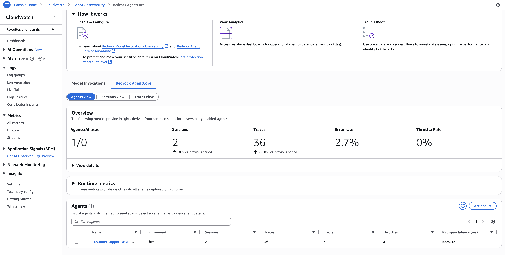
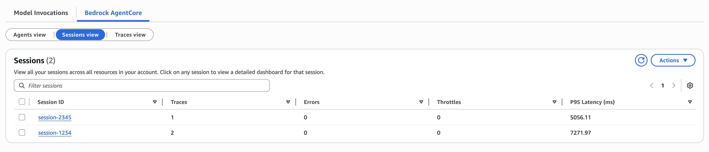
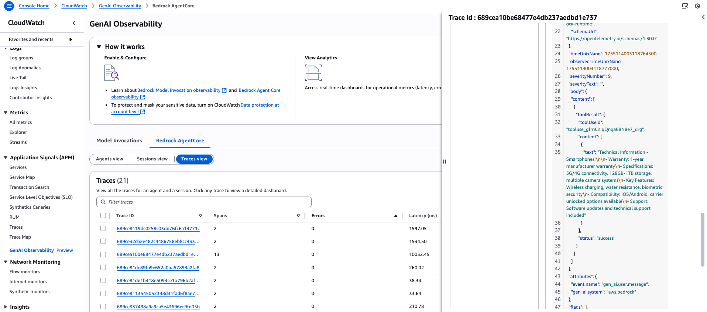

# Module 7: Monitoring your agents with AgentCore Observability

[AgentCore Observability](https://docs.aws.amazon.com/bedrock-agentcore/latest/devguide/observability.html) provides monitoring and tracing capabilities for AI agents using Amazon OpenTelemetry Python Instrumentation and Amazon CloudWatch GenAI Observability. 

In this short module you will learn about core components of AgentCore Observability

## Instrumentation

By default, some of AgentCore components, such as Runtime, emit basic telemetry to [CloudWatch Logs](https://console.aws.amazon.com/cloudwatch/home#logsV2:log-groups). You saw an example of that in the previous module:


In addition to basic logs, you can enable AgentCore components to emit detailed OpenTelemetry (OTEL) formatted logs, metrics, and traces to CloudWatch, S3, or Kinesis. The resources you deployed in previous modules were already instrumented for OTEL, so there's no extra deployments you need to do. Explore Terraform modules for gateway, runtime, memory, and knowledge base - all of them have `observability.tf` configuration. For example, this is how you enable OTEL-based application logs for AgentCore Runtime:

```hcl
# Create a log group
resource "aws_cloudwatch_log_group" "runtime_logs" {
  name              = "/aws/bedrock-agentcore/runtime/applogs/${var.project_name}"
  retention_in_days = 7
}

# Define log source
resource "aws_cloudwatch_log_delivery_source" "runtime_logs" {
  name         = "${var.project_name}-runtime-logs"
  log_type     = "APPLICATION_LOGS"
  resource_arn = aws_bedrockagentcore_agent_runtime.agent.agent_runtime_arn
}

# Define log destination
resource "aws_cloudwatch_log_delivery_destination" "runtime_logs" {
  name = "${var.project_name}-runtime-logs"

  delivery_destination_configuration {
    destination_resource_arn = aws_cloudwatch_log_group.runtime_logs.arn
  }

  output_format = "json"
}

# Attach source and destination
resource "aws_cloudwatch_log_delivery" "runtime_logs" {
  delivery_source_name     = aws_cloudwatch_log_delivery_source.runtime_logs.name
  delivery_destination_arn = aws_cloudwatch_log_delivery_destination.runtime_logs.arn
}
```

## Built-in Observability Dashboard

Use [CloudWatch GenAI Observability](https://console.aws.amazon.com/cloudwatch/home#/gen-ai-observability/agent-core/agents) dashboard to see all the information in one place, such as:

### Agents

AgentCore Runtime configuration allows for logging agent's traces in CloudWatch by means of AgentCore Observability. These traces can be seen on the Amazon CloudWatch GenAI Observability dashboard. Navigate to CloudWatch -> GenAI Observability -> Bedrock AgentCore.



### Sessions

The Sessions view shows the list of all the sessions associated with all agents in your account.



### Traces

Trace view lists all traces from your agents in this account. To work with traces:

- Choose Filter traces to search for specific traces.
- Sort by column name to organize results.
- Under Actions, select Logs Insights to refine your search by querying across your log and span data or select Export selected traces to export.



## Congratulations!

You've completed the workshop! 

## Next Steps

- Proceed to [Module 8](m08-conclusion.md) to summarize what you've learned and see a list of further learning materials. 

