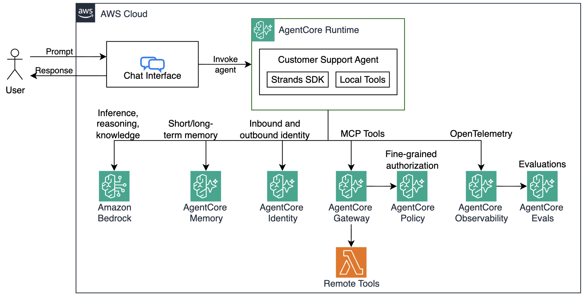

# Module 8: Conclusion and Cleanup

## Congratulations!

You've completed the full workshop! Here's what you built across all seven modules:

| Module | What you added |
|---|---|
| 1 | Local agent prototype with `get_return_policy` and `get_product_info` tools |
| 2 | RAG with Bedrock Knowledge Base — `get_technical_support` answers from real docs |
| 3 | Persistent memory via AgentCore Memory — agent remembers customers across sessions |
| 4 | Centralized, authenticated tools via AgentCore Gateway — `check_warranty_status` over MCP |
| 5 | Secure outbound authentication via AgentCore Identity — credentials stored in Token Vault, never in agent |
| 6 | Production deployment on AgentCore Runtime — containerized, scalable, cloud-hosted |
| 7 | End-to-end observability — OTEL traces, sessions, and logs in CloudWatch GenAI |

You started with a handful of hardcoded mock tools running locally and ended with a production-ready, multi-tenant customer support agent running on fully managed infrastructure — with memory, a knowledge base, centralized tools, secure credential management via AgentCore Identity, and a complete observability pipeline.



The patterns you learned here aren't specific to customer support. Every piece — the tool abstraction, the RAG pipeline, the memory strategies, the Gateway authentication model, the Runtime deployment, the observability hooks — is applicable to any business domain you're working in. Take these building blocks and apply them to your own use case: an internal knowledge assistant, a code review agent, a data analysis copilot, or something nobody has built yet. You now have everything you need to go from prototype to production on AWS.

## Cleanup

> You can skip this step if you're running the workshop in an AWS-provided account

```bash
make destroy
```

## Next steps

Explore the resources below to go deeper on the topics covered in this workshop.

**Amazon Bedrock AgentCore**
- [AgentCore Developer Guide](https://docs.aws.amazon.com/bedrock-agentcore/latest/devguide/what-is-bedrock-agentcore.html) — full reference for Runtime, Memory, Gateway, Identity, and Observability
- [AgentCore Runtime](https://docs.aws.amazon.com/bedrock-agentcore/latest/devguide/runtime.html) — container lifecycle, session management, invocation model
- [AgentCore Memory](https://docs.aws.amazon.com/bedrock-agentcore/latest/devguide/memory.html) — strategies, namespaces, STM/LTM architecture
- [AgentCore Gateway](https://docs.aws.amazon.com/bedrock-agentcore/latest/devguide/gateway.html) — MCP endpoints, JWT authorization, Cedar policies
- [AgentCore Identity](https://docs.aws.amazon.com/bedrock-agentcore/latest/devguide/identity.html) — workload identity, credential providers, Token Vault, OAuth2 flows

**Strands Agents SDK**
- [Strands Agents documentation](https://strandsagents.com) — tool definitions, model providers, session managers, multi-agent patterns
- [Strands Agents GitHub](https://github.com/strands-agents/sdk-python) — source, examples, and community

**Amazon Bedrock**
- [Bedrock Knowledge Bases](https://docs.aws.amazon.com/bedrock/latest/userguide/knowledge-base.html) — RAG, chunking strategies, S3 Vectors, supported embedding models
- [Bedrock model IDs](https://docs.aws.amazon.com/bedrock/latest/userguide/model-ids.html) — full list of available foundation models

