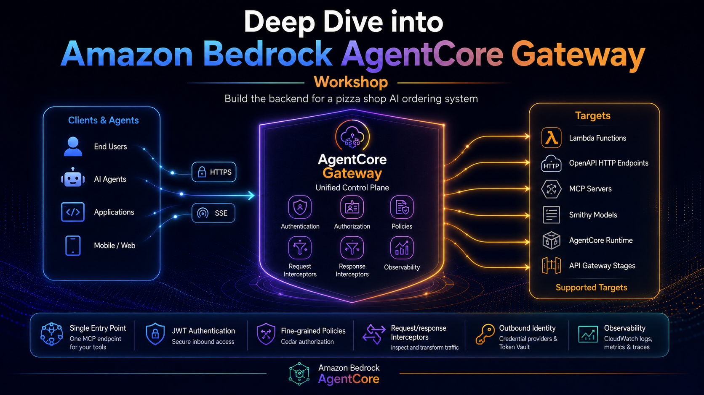

# AgentCore Gateway Deep Dive - Workshop

## Overview

[Amazon Bedrock AgentCore Gateway](https://aws.amazon.com/bedrock/agentcore/) translates Lambda functions and HTTP services into [Model Context Protocol (MCP)](https://modelcontextprotocol.io/) endpoints that any agent framework can discover and call. It handles authentication, authorization, request/response transformation, and secure outbound identity - all without changes to your tool implementations.

In this workshop, you will progressively build a backend and MCP gateway for a **Pizza Shop AI ordering system**. You will expose pizza tools (get menu, create order, get promotions) through AgentCore Gateway and layer on increasingly sophisticated security and transformation controls.

The workshop follows a deliberate learning arc: early modules expose raw MCP calls using `make` and `curl` so you can see exactly what the protocol looks like on the wire. By Module 7 you graduate to a full AI agent built with [Strands Agents SDK](https://strandsagents.com) that discovers and calls those same tools automatically.

## Workshop Journey

* [Module 0: Bootstrap](./m00-bootstrap.md) - Install prerequisites, clone the repo, configure your account
* [Module 1: Understanding AgentCore Gateway](./m01-gateway-basics.md) - Core concepts: MCP, targets, tool schemas, authorizers, interceptors, policy engine, outbound identity
* [Module 2: Your first tool - no auth](./m02-first-tool.md) - Deploy two Lambda-backed pizza tools and call them via MCP using `curl`
* [Module 3: Adding JWT authentication](./m03-jwt-auth.md) - Secure inbound access with Amazon Cognito; test with `curl`
* [Module 4: Adding policies](./m04-policies.md) - Fine-grained Cedar authorization: per-tool permits, scope-based access, argument-based rules
* [Module 5: Adding interceptors](./m05-interceptors.md) - Inspect and mutate requests and responses with a Lambda interceptor
* [Module 6: Outbound identity](./m06-outbound-identity.md) - Secure outbound calls to an HTTP backend using an API Key Credential Provider and AgentCore Identity
* [Module 7: Consuming gateway through an AI agent ](./m07-agent.md) - Run an AI agent built with Strands SDK against your gateway - test all workflows end-to-end
* [Module 8: Observability](./m08-observability.md) - Explore gateway logs, interceptor logs, and traces in CloudWatch GenAI Observability
* [Module 9: Conclusion and cleanup](./m09-conclusion.md) - Recap, key takeaways, resources, and teardown

## Let's get started!

Next step → [Module 0: Bootstrap](./m00-bootstrap.md)
