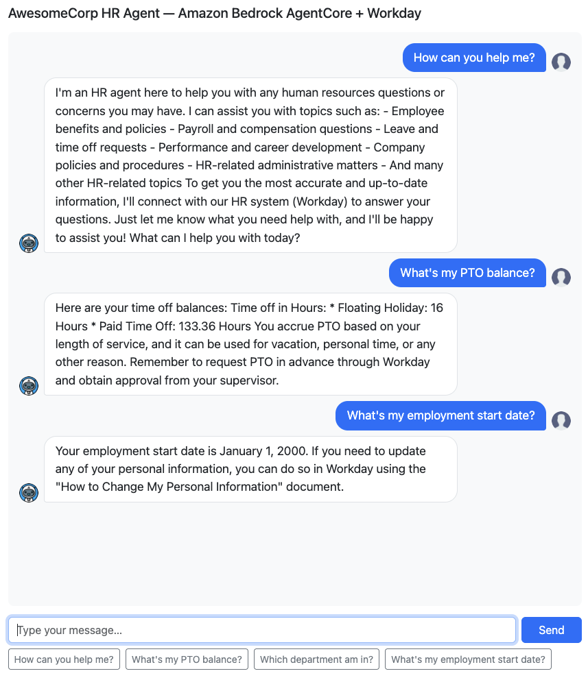
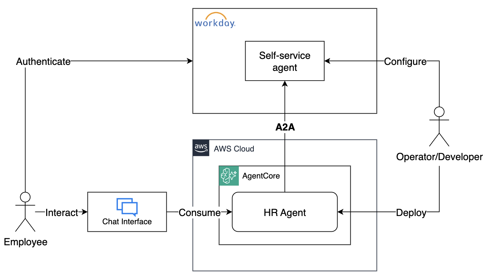

# Integrating Amazon Bedrock AgentCore Agents with Workday Self-service Agent via A2A

## Welcome

In this workshop you will build an HR assistant agent for AwesomeCorp. This agent lets AwesomeCorp employees ask natural-language questions about their employment — PTO balances, pay dates, org structure, and more. The agent will be running on Amazon Bedrock AgentCore and integrate with Workday's Self-service Agent.
 


### What you will build

This is the architecture you will build throughout this workshop:



- **HR Agent** — a Python agent built with the [Strands Agents SDK](https://github.com/strands-agents/sdk-python) framework, hosted on Amazon Bedrock AgentCore Runtime. It receives employee questions and delegates them to Workday Self-service agent via the A2A protocol.
- **Workday Self-service Agent** — Workday's built-in AI agent, accessed over A2A using an OAuth2 credential provider configured in AgentCore.
- **Chat Interface** — a lightweight Terminal app that talks to the HR agent, handling the OAuth2 authorization flow automatically on first use.

### Key AWS components used

| Component | Role |
|---|---|
| [AgentCore Runtime](https://aws.amazon.com/bedrock/agentcore/) | Hosts and scales the HR agent container |
| [AgentCore Identity](https://docs.aws.amazon.com/bedrock-agentcore/latest/devguide/identity.html)  | Issues workload access tokens for the agent |
| [AgentCore OAuth2 Credential Provider](https://docs.aws.amazon.com/bedrock-agentcore/latest/devguide/identity-outbound-credential-provider.html) | Manages OAuth2 tokens for Workday on behalf of users, orchestrating the authentication workflow, provides Token Vault for secure credential storage |

### Workshop flow

The workshop constists of three major steps, each one implements activities performed by three different personas:

1. **Operator** — retrieve Workday agent card and OAuth2 credentials
2. **Developer** — deploy the HR agent to AgentCore using Terraform
3. **Employee** — chat with the HR agent via the Chat Interface

---

## Step 1 - Clone the workshop from Github

```bash
git clone --no-checkout --depth 1 https://github.com/aws-samples/sample-genai-strats
cd sample-genai-strats
git sparse-checkout set workshops/agentcore-workday-integration
git checkout
```

## Step 2 - Obtain Integration API Client access_token and Agent Card for Self-service Agent

In this step you will play the role of the operator persona. You will authenticate with Workday, retrieve an Integration API Client access_token, and use it to obtain Self-service agent's Agent Card. 

> Follow Workday's instructions to create an Integration API Client, configure it, and retrieve credentials. 

1. Update `workday.configuration` file
    - Copy values for **INTEGRATION_CLIENT*** from the Integration API Client defined in Workday
    - Update Integration API Client's Redirect URI configuration in Workday with the value of `INTEGRATION_CLIENT_REDIRECT_URI` property (not not change the value in the `workday.configuration` file)

1. Run the following command:

```bash
make get-agent-card
```

1. Follow the instructions in Terminal. Open authentication URL in your browser, authenticate, grant consent, and copy authorization code back to the Terminal. 

1. The Agent Card will be saved under `./agent/agent_card.json`.

```
Agent card retrieved
| name=Workday Self-Service Agent
| url=https://agent.us.wcp.workday.com/v1/a2a/awsasor_wcpdev1/self-service-agent
| Agent card saved to ./tmp
cp ./tmp/agent_card.json agent/agent_card.json
```

## Step 3 - Deploying the agent to Amazon Bedrock Agent Core

Now that you have obtained the Self-service Agent Card, you can use it to integrate with your agent. In this step you're playing the role of agent developer persona. You will configure your agent to integrate with Workday's Self-service agent and deploy it to Amazon Bedrock AgentCore. 

> Follow Workday's instructions to create an Agent API Client, configure it, and retrieve credentials. 

1. Deploy the agent to AgentCore by running `make deploy-agent-to-agentcore`
1. When Terraform deployment is finished, you will see an output variable named `agent_client_credential_provider_callback_url`. Configure your Agent API Client in Workday with this Redirect URI. 

## Step 4 - Chatting with the agent

In this step you're playing the role of AwesomeCorp employee using the HR agent to ask employment-related questions. You'll do it via a simple chat interface. In order to access the HR agent, you'll need to authenticate with Workday first. 

Run `make run-chat-remote` and start talking to your agent. When you run it for the first time, it will trigger the authentication sequence, similar to one you did in previous steps. Once authenticated, ask the HR agent questions like 

- What's my remaining PTO balance?
- Which department I'm a part of?
- When is the next payday? 


## Clean up

Run `make destroy`
