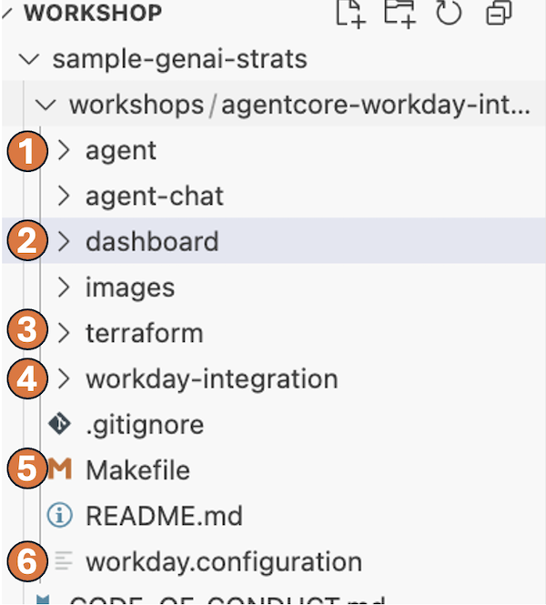
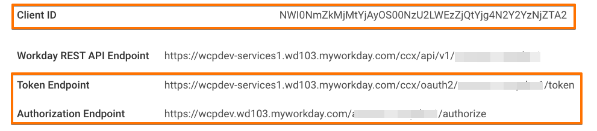
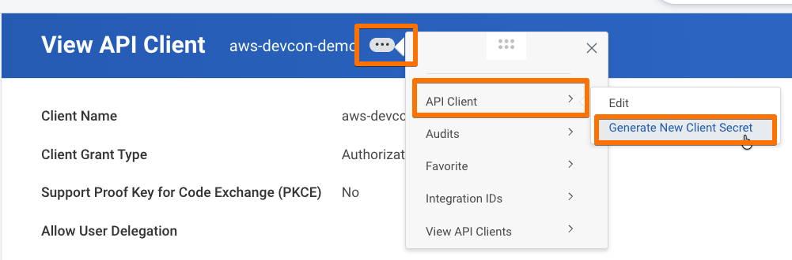
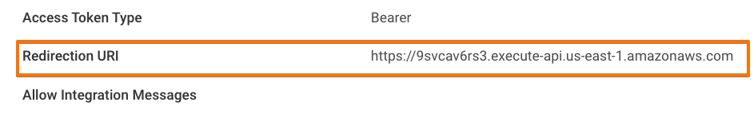
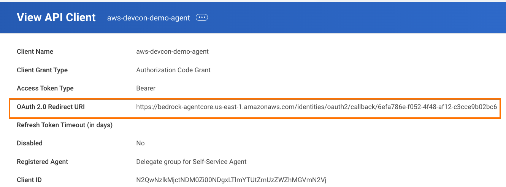
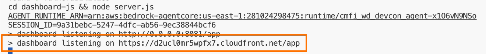

# Integrating Amazon Bedrock AgentCore Agents with Workday Self-service Agent via A2A

## Welcome

In this workshop you will build an HR assistant agent for AwesomeCorp. This agent lets AwesomeCorp employees ask natural-language questions about their employment — PTO balances, pay dates, org structure, and more. The agent will be running on Amazon Bedrock AgentCore and integrate with Workday's Self-service Agent.
 


### What you will build

This is the architecture you will build throughout this workshop:


- **HR Agent** — a Python agent built with the [Strands Agents SDK](https://github.com/strands-agents/sdk-python) framework, hosted on Amazon Bedrock AgentCore Runtime. It receives employee questions and delegates them to Workday Self-service agent via the A2A protocol.
- **Workday Self-service Agent** — Workday's built-in AI agent, accessed over A2A using an OAuth2 credential provider configured in AgentCore.
- **Chat Interface** — a lightweight Dashboard that talks to the HR agent, automatically handling the authentication flow.

### Key AWS components used

| Component | Role |
|---|---|
| [AgentCore Runtime](https://aws.amazon.com/bedrock/agentcore/) | Hosts and scales the HR agent container |
| [AgentCore Identity](https://docs.aws.amazon.com/bedrock-agentcore/latest/devguide/identity.html)  | Issues workload access tokens for the agent |
| [AgentCore OAuth2 Credential Provider](https://docs.aws.amazon.com/bedrock-agentcore/latest/devguide/identity-outbound-credential-provider.html) | Manages OAuth2 tokens for Workday on behalf of users, orchestrating the authentication workflow, provides Token Vault for secure credential storage |

### Workshop flow

The workshop constists of three major steps, each one implements activities performed by three different personas:

1. **Operator** — retrieve Workday agent card and OAuth2 credentials
2. **Developer** — deploy the HR agent to AgentCore using Terraform
3. **Employee** — chat with the HR agent via the Chat Interface

---
## Prerequisites

1. You will need the following tools installed on your system:
- AWS CLI configured with credentials
- Visual Studio Code
- Python 3.13
- Terraform
- Nodejs 22+
- git, jq, uv, make

2. You need a Workday tenant with Agent System of Record (ASOR) capabilities and Self-service Agent enabled. Refer to the Workday documentation for details. You will need the following items:
    - An API Client registered with Workday. You will need properties like client_id, client_secret, authorization URL, and token URL.
    - An API Client for Agents registered with Workday. You will need properties like client_id and client_secret. 

Once you have the above information, proceed with cloning the workshop from Github:

```bash
git clone --no-checkout --depth 1 https://github.com/aws-samples/sample-genai-strats
cd sample-genai-strats
git sparse-checkout set workshops/agentcore-workday-integration && git checkout
cd workshops/agentcore-workday-integration
```

Open the cloned repo in Visual Studio Code (VSCode). Expand the directory tree in the left navigation panel. You will see workshop structure:



1. The HR Agent code you will be deploying to Amazon Bedrock Agent Core.
2. The Chat UI you will use to talk to the Agent.
3. Terraform configuration to provision AWS resources.
4. Helper utilities for interacting with Workday APIs.
5. Makefile with a collection of commands you will be running.
6. A configuration file you will be populating with values from your Workday tenant.

### Step 1: Obtain API Client access_token and retrieve Agent Card for the Self-service Agent

> Pre-requisites
> Make sure the following Workday configuration has been completed:
> * ✅ Workday Self-serice Agent registered and enabled in ASOR
> * ✅ API Client is created
> * ✅ Following API Client properties are available: cliend_id, client_secret, authorization endpoint, token endpoint


In this step you play the role of the operator persona. You will authenticate with Workday, retrieve the API Client access_token, and use it to obtain Self Service Agent's Card.

1. In VSCode, update the workday.configuration file. Populate the values for `API_CLIENT_ID`, `API_CLIENT_SECRET`, `API_CLIENT_AUTHZ_ENDPOINT`, `API_CLIENT_TOKEN_ENDPOINT` properties using infromation from your Workday API Client, for example:



> Note: you can only see CLIENT_SECRET when you create a new API client. If you're using existing API client, you can generate a new secret for it as shown below:



2. In Workday, set the Redirect URI of your API Client to the value of `API_CLIENT_REDIRECT_URI` property from `workday.configuration` (do not change this value in the `workday.configuration` file!)



You can edit your API Client by clicking the three-dots menu on top and selecting API Client -> Edit.

3. Run the following command in VSCode Terminal:

```
make get-agent-card
```

Follow the instructions in Terminal. Open authentication URL in your browser, authenticate, grant consent, and copy authorization code back to the Terminal.

4. The Agent Card will be saved under `./tmp/agent_card.json`

```bash
Agent card retrieved
| name=Workday Self-Service Agent
| url=https://agent.us.wcp.workday.com/v1/a2a/{TENANT_ID}/self-service-agent
| Agent card saved to ./tmp
cp ./tmp/agent_card.json agent/agent_card.json
```

Congratulations! You've used API Client to obtain Self-service Agent's Card. This card contains information about the Self-service Agent, such as its endpoint and available skills.

> [Optional] If you want to learn more about Agent Card, explore the retrieved file at tmp/agent_card.json.

---

## Step 2: Deploying the HR Agent to Amazon Bedrock AgentCore

> Pre-requisites
> * ✅ Step 1 was completed successfully
> 
> Make sure the following Workday configuration has been completed:
> * ✅ Agent API Client created
> * ✅ Following Agent API Client properties are available: cliend_id, client_secret

Using the Workday Self-Service Agent Card obtained in the previous step, you will now configure your HR Agent to communicate with Workday. In this step you're playing the role of the agent developer persona. You will configure HR Agent to integrate with Workday's Self-service agent and deploy it to Amazon Bedrock AgentCore.

1. In VSCode, update the `workday.configuration` file. Populate the values for `AGENT_CLIENT_ID` and `AGENT_CLIENT_SECRET` properties using infromation from your Workday API Client for Agents.

> Note: API Client for Agents is not the same as API Client you've used in Step 1.

2. Deploy the agent to AgentCore by running below command

```bash
make deploy-agent-to-agentcore
```

3. The output of the above command will contain a property named `agent_client_credential_provider_callback_url`. In Workday, set the Redirect URI of your API Client for Agents to the value of this property.

```
Apply complete! Resources: 14 added, 0 changed, 0 destroyed.

Outputs:

agent_client_credential_provider_callback_url = "https://bedrock-agentcore.us-east-1.amazonaws.com/identities/oauth2/callback/6efa786e-f052-4f48-af12-c3cce9b02bc6"
```



Congratulations! You've successfully configured and deployed your HR Agent to Amazon Bedrock AgentCore. In the next step, you will use your HR Agent to discuss employment-related information.

---

### Step 3: Talk to the Agent using Dashboard

> Pre-requisites
> * ✅ Steps 1 and 2 were completed successfully

In this step you're playing the role of an employee using the HR agent to ask employment-related questions. You'll do it via a simple chat interface. In order to access the HR agent, you'll need to authenticate with Workday first.

Run the following comand to start the agent Dashboard.

```bash
make start-dashboard
```

Click the CloudFormation URL in the Terminal to open the Dashboard in a new tab.



When you connect to the agent for the first time, it will trigger the authentication sequence, similar to one you did in previous steps. Once authenticated, ask the HR agent questions like

- What's my remaining PTO balance?
- Which department I'm a part of?
- When is the next payday?


Congratulations! You've successfully deployed and used HR Agent integrated with Workday using Amazon Bedrock AgentCore.

## Clean up

Run `make destroy`
